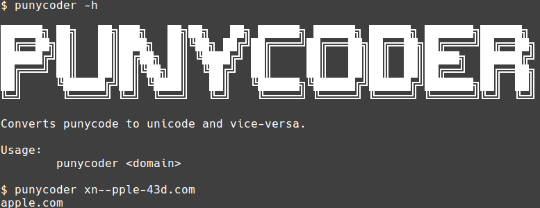

# Punycoder
[](https://github.com/jakewarren/punycoder/releases])
[](https://github.com/jakewarren/punycoder/blob/master/LICENSE)
[](https://goreportcard.com/report/github.com/jakewarren/punycoder)

Converts punycode domains to unicode and vice-versa.



## Installation

### Option 1: Binary

Download the latest release from [https://github.com/jakewarren/punycoder/releases](https://github.com/jakewarren/punycoder/releases)

### Option 2: From source

```
go get github.com/jakewarren/punycoder
```

## Usage

Simply provide either a punycode (IDN) or Unicode domain and it will be converted automagically.

```
$ punycoder bücher.example.com
xn--bcher-kva.example.com
$ punycoder xn--bcher-kva.example.com
bücher.example.com
```
